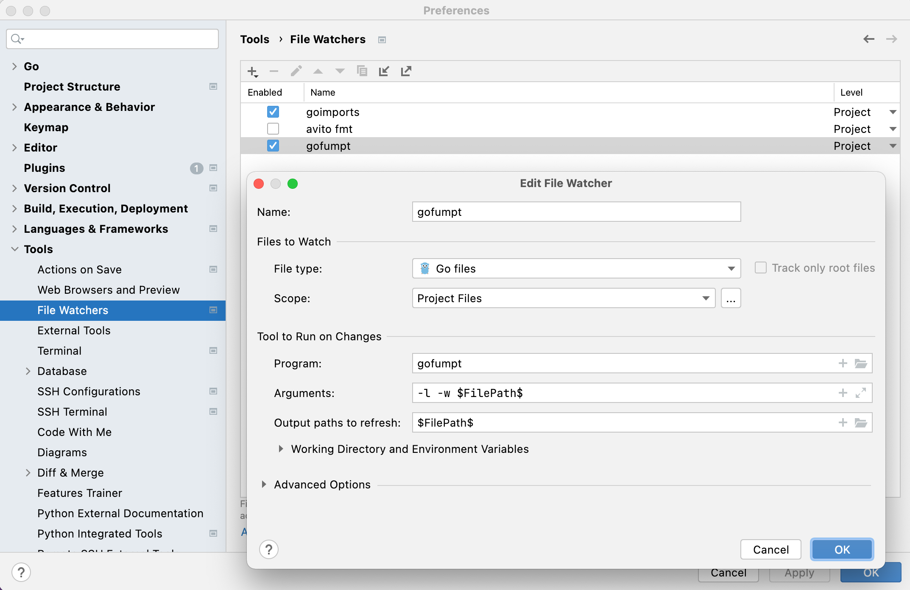

# init-instructions

# Go project must have

The tool is a modified fork of gofmt

[gofumpt](https://github.com/mvdan/gofumpt)

#### Goland File watch

!Важно. Не забыть в Advanced Options убрать галочку на Auto-save. Иначе заебет